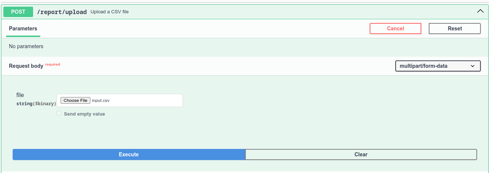
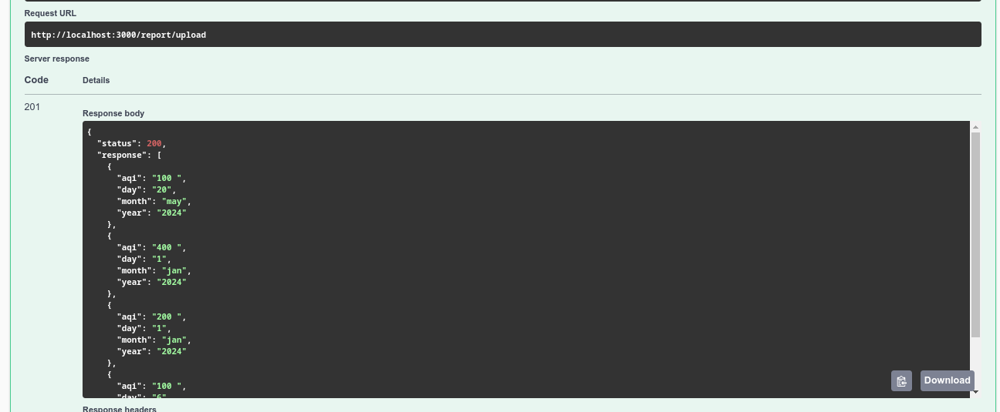

<h1>Air Quality Analyzer Backend</h1>

### This is a backend service to air quality analyzer that allows reports generated from the IOT device to be uploaded and saved.

  <p>
      <ul>
        <li>The report generated by the IOT device will be in CSV format.</li>
        <li>I have created endpoint for uploading a CSV report and saving it in some persistent storage , such as MongoDB.</li>
        <li>The data are cleaned before saving it. CSV reports can have both proper rows and malformed rows. Cleaning the data means filtering out any row of data with malformed values.</li>
        <li>I have written API to generate a report tht provides insights on particular month.</li>
      </ul>
  </p>

## Project setup

```bash
$ npm install
```

## Compile and run the project

```bash
# development
$ npm run start

# watch mode
$ npm run start:dev

#Swagger API
http://localhost:3000/api

```

## Tools Used

<p>
<!-- <a href="https://docs.nestjs.com/"> </a> -->
<ul>
<li>Nestjs</li>
<li>Swagger</li>
<li>MongoDB</li>
<li>Mongoose</li>
</ul>

</p>

## Schema for database

<p>
 <ul>
 <li><strong>aqi </strong> stands for Air Quality Index - The proper range is from 0 to 400 (inclusive). Any other value is invalid.</li>
 <li><strong>day </strong>- The day the air quality was measured, will be sent in numeric format, eg: 1 , 2</li>
 <li><strong>month</strong> - The month the air quality was measured. The valid format is of three letters representing the first three letters of a month. (jan for January, feb for February). Any other value will be considered invalid.</li>
 <li><strong>year </strong> - The year air quality was measured. Will of YYYY format. Example: 2024, 2023, 1990</li>
 </ul>
<p>

## API

### File Upload API

```
This API allows users to upload a CSV file to the server. The uploaded file is stored in a local directory, and the application processes the file for further operations.

-> Endpoint: /report/upload
-> Method: POST
-> Consumes: multipart/form-data
-> Summary: Upload a CSV file
-> Request Body:
      file: CSV file to upload (type: binary).
-> Usage:
    To upload a CSV file, make a POST request to the /upload endpoint, with the file attached as form data. Also after  uploading the file it checks the data inside the file and if it is in correct format then it is saved to database else the incorrect data is removed.

```

#### Response of File Upload API

```
{
  "status": 200,
  "response": [
    {
      "aqi": "100 ",
      "day": "20",
      "month": "may",
      "year": "2024"
    },
    {
      "aqi": "400 ",
      "day": "1",
      "month": "jan",
      "year": "2024"
    },
    {
      "aqi": "200 ",
      "day": "1",
      "month": "jan",
      "year": "2024"
    },
    {
      "aqi": "100 ",
      "day": "6",
      "month": "feb",
      "year": "2024"
    }
  ]
}
```

### Report Generation API

```
This API allows users to generate a report from the server based on month and year provided as a query by the user. On getting month and year, the code fetches the data from the database if available. once the data is fetched it calculates minimum , maximum and average value of AQI in the given month of the year and hence the report is returned to the user.

-> Endpoint: /report/generate
-> Method: GET
-> Summary: Generates report based on given month and year.
-> Usage:
   To generate report of air quality based on query of given month of the year.

```

#### Response of report generation API

```
{
  "status": 200,
  "report": {
    "month": "jan",
    "year": 2024,
    "avg": 300,
    "category": "Very unhealthy",
    "max": 400,
    "min": 200,
    "list": [
      {
        "date": "1/01/2024",
        "aqi": 200
      },
      {
        "date": "1/01/2024",
        "aqi": 400
      }
    ]
  }
}
```

### Images from Swagger


<b>Fig: File uploading place in swagger</b>

<br>

<b>Fig: Report Generation parameters</b>

<br>

<b>Fig: File Upload response</b>

<br>

<b>Fig: Report generation response</b>
